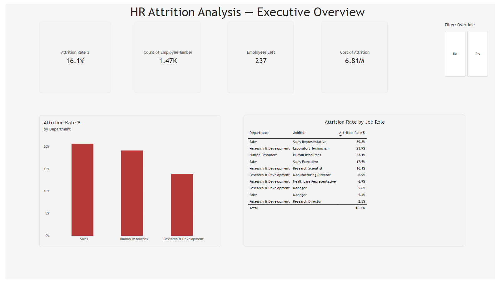
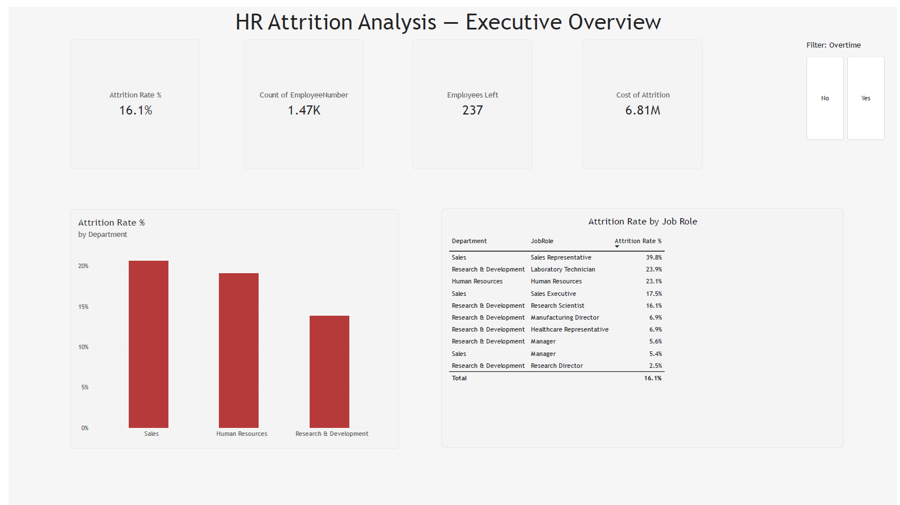

# HR Employee Attrition Analysis

End-to-end HR analytics project identifying the drivers of employee attrition, 
quantifying its financial cost, and delivering prioritized, actionable retention 
recommendations — built using Python, SQL, Excel, and Power BI.

## 🎯 Business Problem
A mid-size company's HR Director noticed rising attrition and needed to know: 
which employee segments are most affected, what's driving it, and what should be 
fixed first — with data-backed justification for any retention budget.

## 📊 Key Findings
- **Overtime, not department, drives Sales attrition** — Sales employees working 
  overtime attrite at 37.50% vs 13.84% for non-overtime peers
- **Pay matters most for early-career employees** — controlling for tenure, the 
  pay gap between leavers and stayers is 35% for 0-2yr employees, reversing 
  entirely for 10+yr employees
- **Highest-risk profile identified**: Sales Representatives working overtime 
  attrite at 66.67% — over 4x the company baseline
- **Rate ≠ Cost**: Sales has the higher attrition rate, but R&D's larger 
  headcount means it contributes nearly equal total cost ($3.26M vs $3.28M/year)
- **Total estimated annual cost of attrition: $6.8M**

Full analysis: [`business_insights.md`](./business_insights.md)

## 🛠️ Tools & Skills Demonstrated
- **Python (pandas)**: data cleaning, EDA, confounding-variable analysis
- **SQL (SQLite)**: CASE WHEN, GROUP BY, subqueries, CTEs, window functions (RANK)
- **Excel**: Pivot Tables, calculated fields, charts
- **Power BI**: DAX measures (DIVIDE, SUMX, CALCULATE), interactive slicers, 
  2-page executive dashboard

## 📁 Repository Structure

hr-attrition-analysis/
├── data/
│ ├── raw/ # Original IBM HR Analytics dataset
│ └── cleaned/ # Cleaned dataset used for analysis
├── sql/ # Standalone .sql query files
├── notebooks/ # Python EDA & analysis notebook
├── excel/ # Pivot table workbook
├── powerbi/ # Power BI dashboard (.pbix)
├── images/ # Dashboard screenshots
├── business_insights.md # Full findings & recommendations
├── insights.md # Running analysis log
└── README.md

## 📈 Dashboard Preview

**Page 1: Executive Overview**

**Page 2: Cost & Root Cause Analysis**

## 🔍 Methodology
1. **Business Understanding** — defined stakeholders, objectives, and success metrics
2. **Data Cleaning** — removed constant columns, engineered attrition flag, verified 
   no missing values/duplicates
3. **EDA (Python)** — baseline attrition rate, segment analysis, confounding-variable 
   checks (income vs. tenure)
4. **SQL Analysis** — rebuilt and extended findings using CASE WHEN, GROUP BY, CTEs, 
   and window functions (RANK)
5. **KPI Design** — Attrition Rate, Cost of Attrition, High-Risk Group Concentration
6. **Power BI Dashboard** — 2-page interactive dashboard with DAX measures and slicers
7. **Business Insights & Recommendations** — prioritized by risk concentration and 
   cost of intervention

## 💡 Dataset
[IBM HR Analytics Employee Attrition & Performance](https://www.kaggle.com/datasets/pavansubhasht/ibm-hr-analytics-attrition-dataset) 
— 1,470 employees, 35 features. Publicly available on Kaggle.

## 🚀 How to Reproduce
1. Clone this repo
2. Run `notebooks/hr_attrition_analysis.ipynb` to reproduce cleaning and EDA
3. Open `powerbi/hr_attrition_dashboard.pbix` in Power BI Desktop to explore the 
   interactive dashboard
4. SQL queries in `sql/` can be run against the SQLite database generated in the 
   notebook

---
*Note: This is a well-known, relatively clean public dataset. Real workplace data 
typically requires more extensive cleaning — see [`insights.md`](./insights.md) for 
the full analytical log, including confounding-variable checks and methodology notes.*